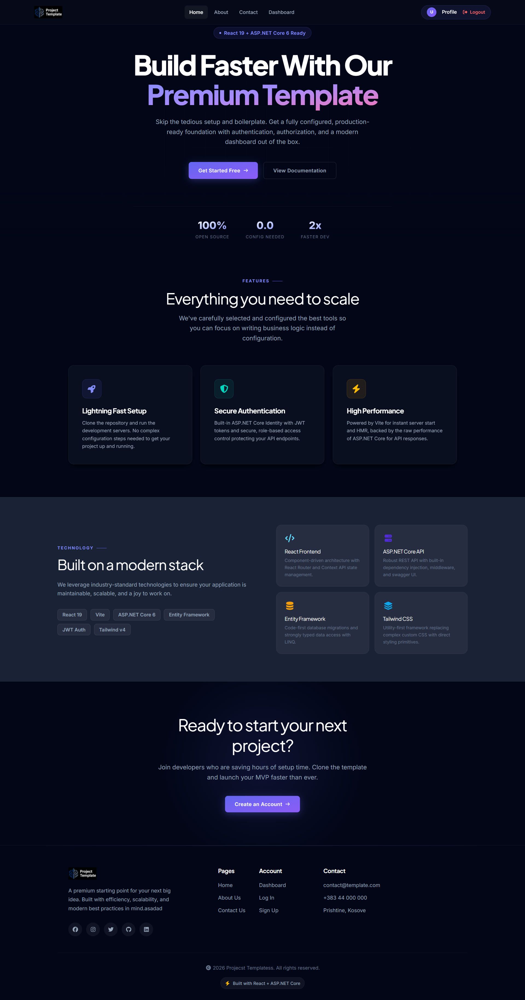
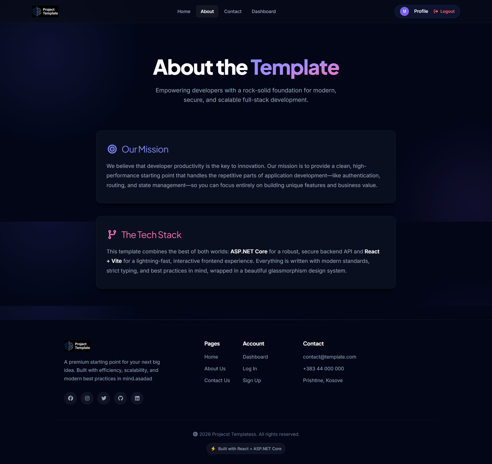
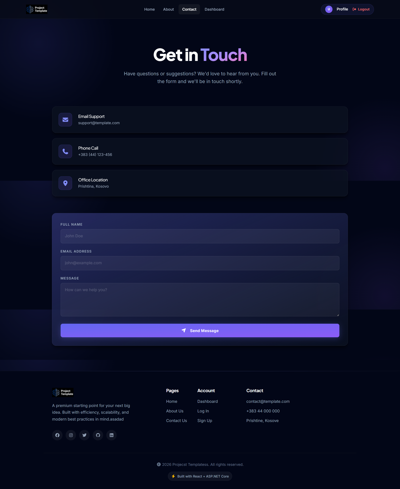
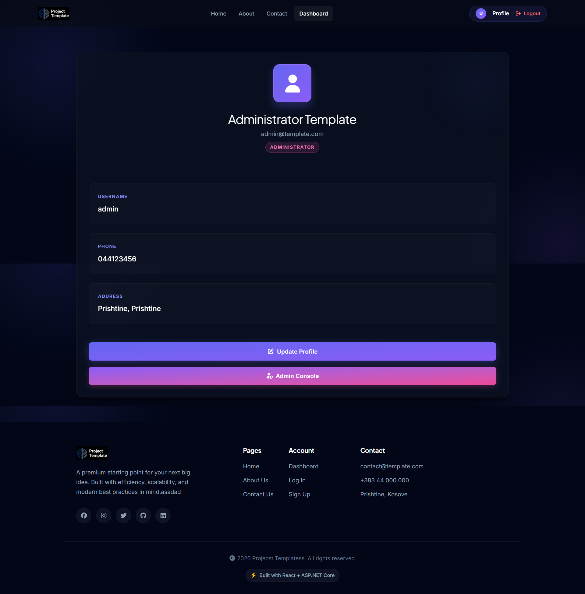
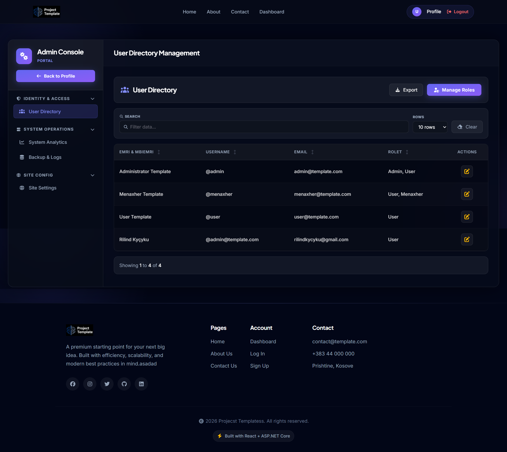
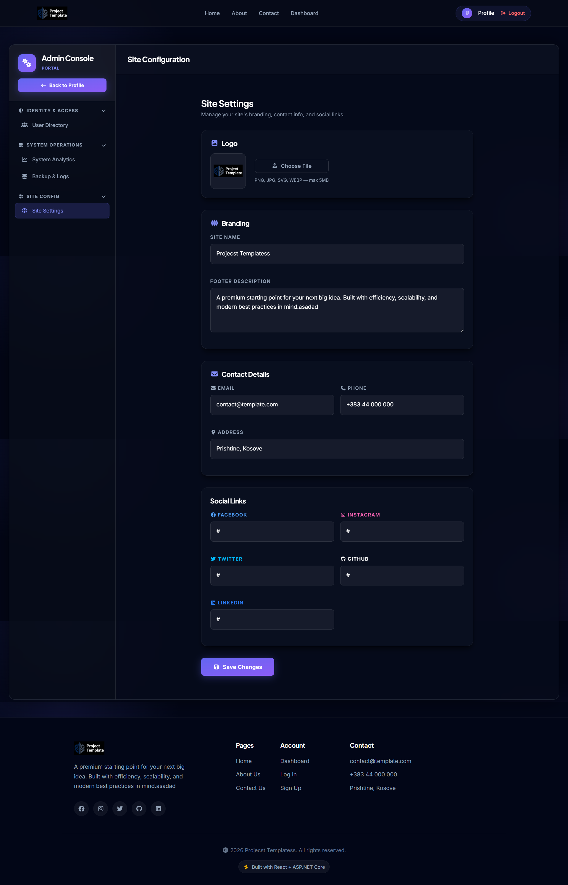
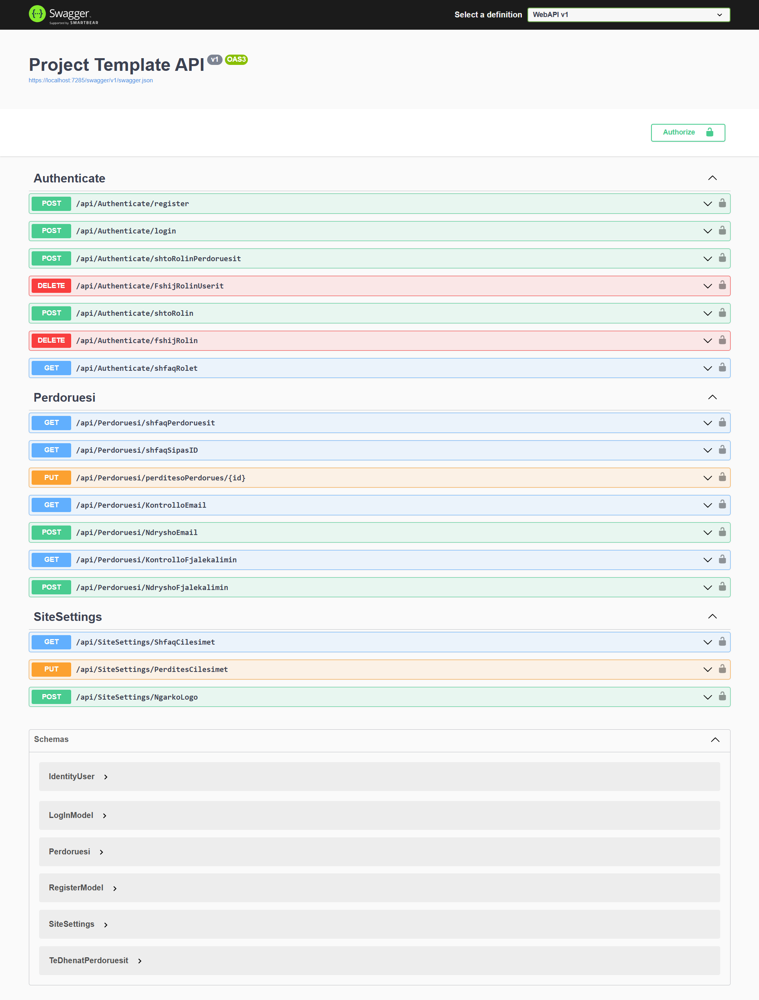

# ProjectTemplate

## Rreth Projektit

> [!WARNING]
> **Kujdes:** Ky projekt është ende në zhvillim e sipër (under development). Arkitektura dhe kodet mund të ndryshojnë në çdo kohë dhe mund të ketë prezencë të 'bugs'.
> 
> *Ky projekt është ndërtuar duke u bazuar në arkitekturat e projekteve të mëparshme: **FinanCare** dhe **TechStore-Lab1**.*

Ky projekt eshte nje **Template i plote** per aplikacione Web te ndertuar me teknologjite moderne.

Ky projekt eshte i punuar ne:

- **React JS + Vite** - Frontend
- **ASP.NET Core** - Backend (WebAPI)
- **MSSQL** - Database
- **Tailwind CSS** - Stilizimi

## Konfigurimi

Se pari duhet te behet konfigurimi i Connection String ne `WebAPI/WebAPI/appsettings.json` dhe duhet te nderrohet emri i serverit me ate te serverit tuaj:

```json
"ConnectionStrings": {
  "Conn": "Server=EMRI_I_SERVERIT_TUAJ; Database=ProjectTemplateDB; Trusted_Connection=True; TrustServerCertificate=True"
}
```

Pastaj ne **Visual Studio**, ne **Package Manager Console** (me projektin **WebAPI** si Default Project), duhet te beni run komanden:

```
EntityFrameworkCore\update-database
```

Kjo do te gjeneroje automatikisht Databasen dhe do te insertoje te dhenat bazike (rolet dhe perdoruesit fillestar).

Pastaj duhet te startoni **WebAPI** nga Visual Studio, dhe ne **VS Code / Terminal** te hapni folderin `frontend` dhe te beni run keto komanda:

```
- npm install - Instalon paketat e nevojshme (vetem here e pare)
- npm run dev - Starton serverin e development-it
```

Pasi qe te behet konfigurimi, ju mund te kyqeni me keto te dhena:

| **Email** | **Password** | **Aksesi** |
| --- | --- | --- |
| admin@template.com | Admin1@ | Administrator (Akses i Plote) |
| menaxher@template.com | Menaxher1@ | Menaxher (Akses i Pjesshem) |
| user@template.com | User1@ | Perdorues (Akses i thjesht) |

## Struktura e Projektit

```
ProjectTemplate/
├── WebAPI/          → ASP.NET Core Backend
│   └── WebAPI/
│       ├── Controllers/
│       ├── Data/
│       ├── Migrations/
│       └── appsettings.json
└── frontend/        → React + Vite Frontend
    └── src/
        ├── Components/
        ├── Context/
        ├── Pages/
        └── api/
```

## Teknologjite e Perdorura

| Teknologjia | Versioni | Perdorimi |
| --- | --- | --- |
| React | 18+ | UI Framework |
| Vite | 5+ | Build Tool |
| Tailwind CSS | 4+ | Stilizimi |
| ASP.NET Core | .NET 6 | REST API |
| Entity Framework Core | 7 | ORM / Migrations |
| SQL Server | - | Database |
| JWT | - | Autentikimi |
| FontAwesome | 6 | Ikonat |

## Pamje nga Projekti (Screenshots)

### Ballina (Home Page)


### Rreth Nesh


### Kontakti


### Paneli i Përdoruesit (Dashboard)


### Paneli i Administratorit (Admin Console)



### Web API (Swagger UI)

